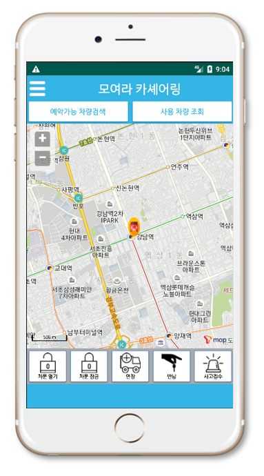
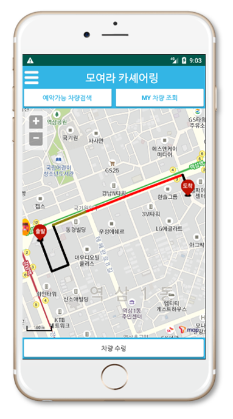

# Moyeora(모두의 여가 라이프) - Mobile App
> 자율주행 자동차 카쉐어링을 통해 차량을 원하는 장소에서 빌리고 반납할 수 있는 서비스

## 프로젝트 설명
혁신성장 청년인재 프로젝트 (자율주행 카쉐어링 시스템) - Mobile App

## 서비스 구조도

## 구현된 기능
> - 예약 가능한 자율주행 차량 검색 기능
> - 예약한 차량 위치 조회 기능
> - 차량 제어 기능 (차문 제어, 예약, 반납)
> - 이용자 커스텀 설정 기능 (이용자의 선호 온도 및 조명 설정)

## 구현된 페이지 예시
                   
모바일 App의 예약 차량 위치 조회 UI                       

모바일 App의 차량 제어 UI

## 역할 분담
* 모바일 App UI 개발 : 오창영
* API 서버와 연동 로직 개발 : 민필규
* T Map API 연동 로직 개발 : 지민후

